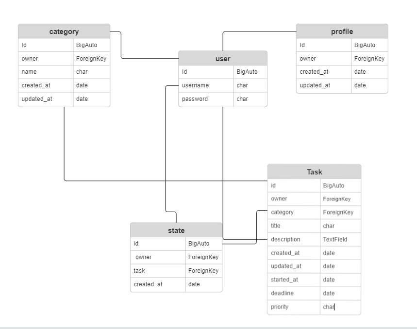
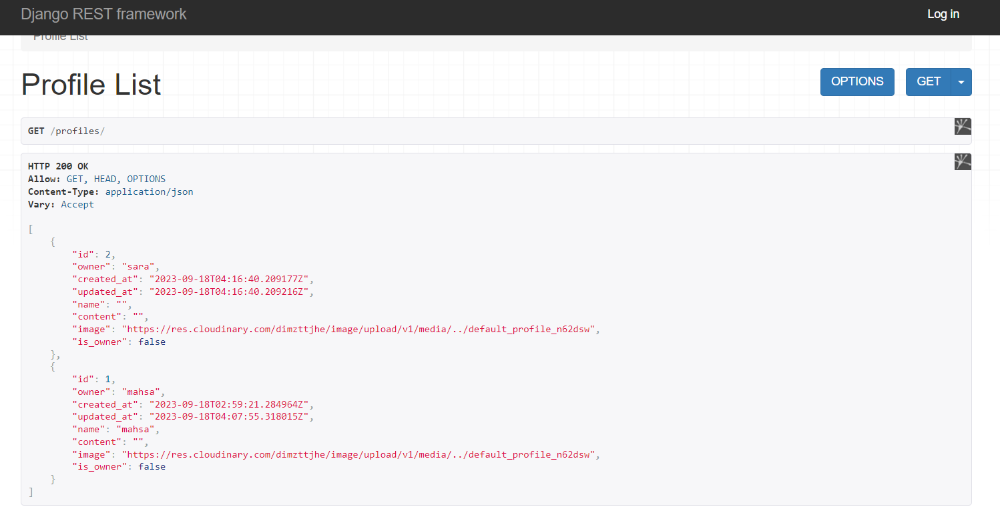
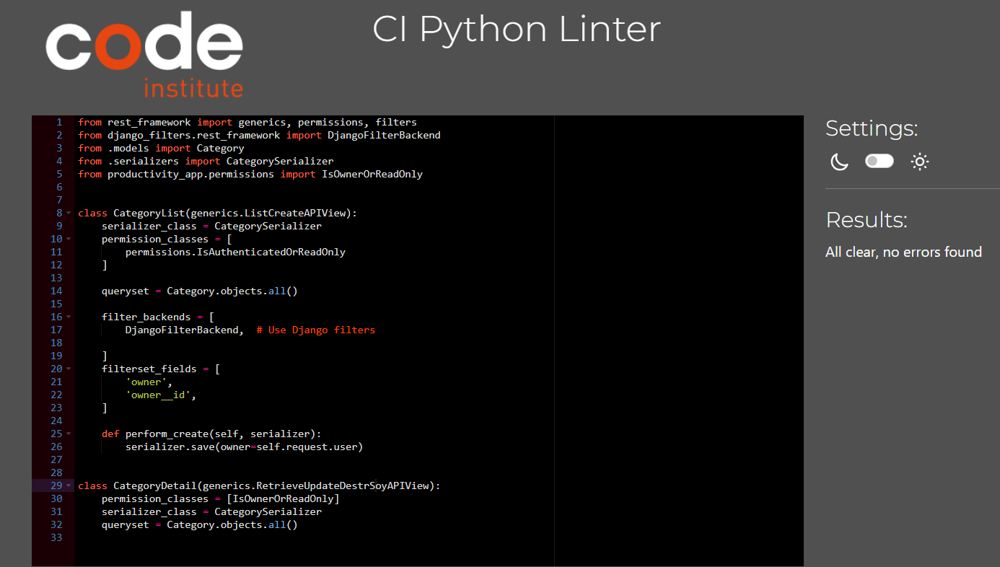

# DRF for task to do app
***
[Link for Repository](https://github.com/Mahsak89/productivity-app)

[Link for API](https://productive-c40034b33280.herokuapp.com/)

Here is an API provided by DJANGO REST FRAMWORK, so that users can   make a task to do app without accessing to the backend straightly.

## Features
***
### ***AUTHENTICATION***
* users can easily:

    * Register
    * Login
    * Logout
### ***CRUD FOR PROFILES***
* List
* Instantly create profilesafter a user is created(using signal)
* Retrieve
* Edit

### ***CRUD FOR TASKS***
* List
* Create
* Delete
* Retrieve
* Edit

### ***CRUD FOR CATEGORIES***
* List
* Create
* Delete
* Retrieve
* Edit

### ***CRUD FOR STATES***
* List
* Create
* Delete
* Retrieve

### ***FILTERING***

for post profile and category

## Data Model

***
I decided to create 4 different app to build my task to do API other than the user which is created by default.

## Testing
***
I have manually tested the project by  doing the following :
* Passed the code through a PEP8 linter and confirmed that there are no problems
* Tested my code with invalid and valid  inputs: to check both errors and permissions
  * CRUDS AND Permissions like:( u can see alot of more manula pic test in image folder in the drf folder.)
   

  
### ***Validator Testing***
* PEP8
  * No errors were returned from PEP8online.com
  
  
  I also test my app automatically in test.py in each app folder(tasks,profile...)

## Deployment
***
This project was deployed using Code Institute's mock terminal for Heroku. Below are the steps I followed to be able to deploy the terminal to the website:

  1. Create a new Heroku app on the Heroku website.
  2. Set config vars

  3. Link the Heroku app to the repository on GitHub.
  4. Click on Deploy.

### Create Repository
  
For this I used Github.

 * Go to your profile, and press on "Repositories".
 * Press "New" (Big green button).
 * There I chose to use a template from Code Institute to have everything I needed for this project.
 * Named my project [productivity-app](https://github.com/Mahsak89/productivity-app).
 * Then clicked on "Create repository".
 * Onces created, I opened the repository and clicked on "COdeanywhere" to create a new workplace.

### Fork Repository on GitHub

A copy of the GitHub Repository can be made by forking the GitHub account. Changes can be made on this copy without affecting the origional repository.

* Log in to GitHub and locate the repository in question.
* Locate the Fork button which can be found in the top corner, right-hand side of the page, inline with the repository name.
* Click this button to create a copy of the origional repository in your GitHub Account.

###  To Clone The Repository on GitHub

* Click on the code button which is underneath the main tab and rdepository name to the right.
* In the "Clone with HTTPS' section, click on the clipboard icon to copy the URL.
* Open Git Bash in your IDE of choice.
* Change the current working directory to where you wan the cloned directory to be made.
* Type git clone, and then paste the URL copied form GitHub.
* Press enter and the clone of your repository will be created.
## Credits
***
 * Slack community for information and also the few that helped me with the issues what I got. 
 * [CodeInstitute](https://learn.codeinstitute.net/courses).
 * [YouTube](https://www.youtube.com/results?search_query=python+battleship+game)
